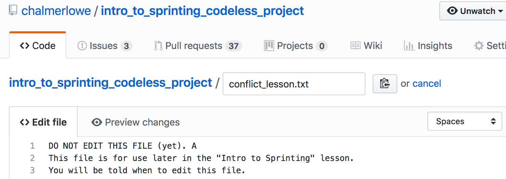
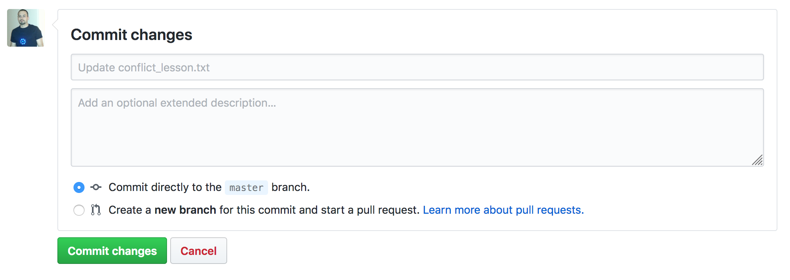
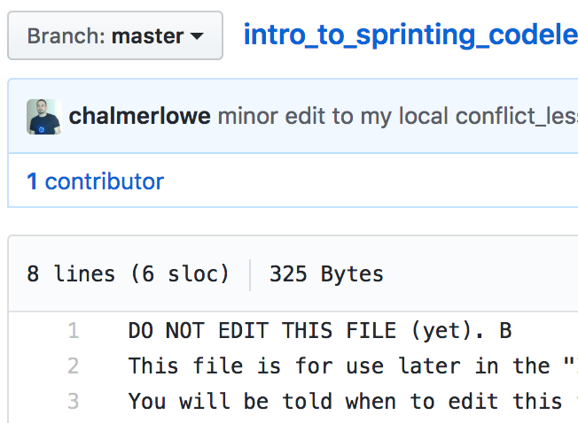

<!-- begin auto-generated title section --><!-- end auto-generated section -->

## Time-box

<XX> Minutes

## Overview

THIS FILE IS A WORK IN PROGRESS....

When working on open source projects you will often find yourself working with others on that same project, which means:

1. you will occasionally have to incorporate their changes into your local repository to see how the project may have evolved
1. some of the changes in that evolution will result in a conflict with your changes

If their changes are completely different from any changes we have made (i.e. if they modify File A, while we modify File B), then there should be no conflicts and it should be fairly trivial to merge the changes.  

Similarly, if their changes are in the same file that we changed, but are in completely separate portions of the file, we can often merge without conflict.

**But** if our changes are in the same file and overlap, it becomes difficult for `git` to automagically merge our changes. In those cases, `git` will turn over the merge process to us, to do manually, but will do its best to help.

## What to do

### ON GITHUB:
**Edit the file conflict_lesson.txt in your GitHub fork:**

Find the text file `conflict_lesson.txt` in **your** GitHub fork.

Open `conflict_lesson.txt` on GitHub **for editing** by clicking on the small pencil at the far right side of the screen.


Change just the first line by adding the letter `A` at the end of the line so that it looks something like this: (Please ensure you don't make any other changes to the file)

```bash
DO NOT EDIT THIS FILE (yet). A
```



**Commit the change**

Click the **Commit Changes** button at the very bottom of the page.

It is not necessary, for this example, to add text to the empty fields. 



### IN YOUR TERMINAL:
**Create and switch to a new branch** called `conflict-merge`

```bash
$ git checkout -b conflict-merge
```

**Edit the file conflict_lesson.txt locally:**
 
Open `conflict_lesson.txt` in your local repository with a text editor. 

Change just the first line by adding the letter `B` at the end of the line, so it looks something like this:

```bash
DO NOT EDIT THIS FILE (yet). B
```

**NOTE:** ENSURE that you end up with two different changes in the two files, so that they won't match when you go to merge them.

**Add and commit your local changes**

In your local repo, run the following commands:

```bash
$ git add conflict_lesson.txt
$ git commit -m "minor edit to my local conflict_lesson.txt"
```

**Switch back to master**

```bash
$ git checkout master
```

**Pull down the changes you made on your GitHub repo** by pulling from `origin master`

```bash
$ git pull origin master
``` 

**NOTE**: as mentioned in the previous lesson, normally, you would prioritize getting changes from `upstream` by pulling from `upstream master`, but since you made your changes to **your** GitHub repo, we are using this as a workaround for the purposes of this lesson.

**Attempt to merge** the versions in your `master` branch and your `conflict-merge` branch using the `merge` command:

```bash
$ git merge conflict-merge
```

You should see an error message that looks like this:

```bash
$ git merge conflict-merge
Auto-merging conflict_lesson.txt
CONFLICT (content): Merge conflict in conflict_lesson.txt
Automatic merge failed; fix conflicts and then commit the result.
```

**Fix the conflict**

Open the file with a text editor and you should see that the file now includes text from both sources:

```
<<<<<<< HEAD
DO NOT EDIT THIS FILE (yet). A        
=======
DO NOT EDIT THIS FILE (yet). B
>>>>>>> conflict-merge
This file is for use later in the "Intro to Sprinting" lesson.
You will be told when to edit this file.
...
```

Using your text editor, delete the lines that `git` added and any lines you don't want to retain. In this case, **keep change B**. Your final local file should look something like this:

```
DO NOT EDIT THIS FILE (yet). B
This file is for use later in the "Intro to Sprinting" lesson.
You will be told when to edit this file. 
...   
``` 

**Add, commit and push** the newly revised file:

```bash
$ git add conflict_lesson.txt
$ git commit -m cleaned up conflict
$ git push
``` 

### ON GITHUB:
**Confirm that your local changes** are now up on your GitHub repository.



**Congratulations**, if all went well, you have now resolved your first merge conflict and your code is ready to be submitted for a pull request.

## The big picture

Git has excellent algorithms to make best effort attempts to merge files even if two files differ significantly from one another. Despite this ability, sometimes changes are so complicated that Git gets lost and just can't decipher which of the part of which file should be retained. 

When you `git merge` and `git` finds a conflict, it makes a best effort to retain the conflicting portion of each file and present them to you in a single file. It annotates each conflicting content so you can compare the changes side-by-side in context. After generating this partially merged but conflicting file, `git` leaves it up to you to manually edit those portions of the file it annotates for you as conflicting. Upon cleaning up the conflict, you proceed as normal: `git add`, `git commit`, `git push`.

## Deep dive

To demonstrate how to merge a conflict, we want to try and create two versions of the same file with conflicting changes and cause `git` to attempt a merge.

Under normal circumstances conflicts occur when a change is made to a file in your local repository and the same file in the upstream repository. This typically occurs because someone else edits the file and gets it incorporated in the upstream repo at the same time as you are making your changes.

Causing that effect is not viable in a self-study tutorial OR is difficult in a instructor-led workshop, so we are gonna simulate this effect by having the student edit a file in their GitHub and then editing the same file in their local repository.

### ON GITHUB:
**Edit the file conflict_lesson.txt in your GitHub fork:**

Find the text file `conflict_lesson.txt` in **your** GitHub fork.

Open `conflict_lesson.txt` on GitHub **for editing** by clicking on the small pencil at the far right side of the screen.


Change just the first line by adding the letter `A` at the end of the line so that it looks something like this: (Please ensure you don't make any other changes to the file)

```bash
DO NOT EDIT THIS FILE (yet). A
```


**Commit the change**

Click the **Commit Changes** button at the very bottom of the page.

It is not necessary, for this example, to add text to the empty fields. Normally, you would want to communicate the nature of the changes to the file in just the same way as you would document any other commit. In fact, the two fields are exactly the same as if you provided a long-form `git commit` message with a subject and body.


### IN YOUR TERMINAL:
**Create and switch to a new branch** called `conflict-merge`

```bash
$ git checkout -b conflict-merge
```

**Edit the file conflict_lesson.txt locally:**
 
Open `conflict_lesson.txt` in your local repository with a text editor. 

Change just the first line by adding the letter `B` at the end of the line, so it looks something like this:

```bash
DO NOT EDIT THIS FILE (yet). B
```

**NOTE:** ENSURE that you end up with two different changes in the two files, so that they won't match when you go to merge them.

**Add and commit your local changes**

In your local repo, run the following commands:

```bash
$ git add conflict_lesson.txt
$ git commit -m "minor edit to my local conflict_lesson.txt"
```

**Switch back to master**

```bash
$ git checkout master
```

**Pull down the changes you made on your GitHub repo** by pulling from `origin master`

```bash
$ git pull origin master
``` 

**NOTE**: as mentioned in the previous lesson, normally, you would prioritize getting changes from `upstream` by pulling from `upstream master`, but since you made your changes to **your** GitHub repo, we are using this as a workaround for the purposes of this lesson.

**Attempt to merge** the versions in your `master` branch and your `conflict-merge` branch using the `merge` command:

```bash
$ git merge conflict-merge
```

You should see an error message that looks like this:

```bash
$ git merge conflict-merge
Auto-merging conflict_lesson.txt
CONFLICT (content): Merge conflict in conflict_lesson.txt
Automatic merge failed; fix conflicts and then commit the result.
```

**Fix the conflict**

Open the file with a text editor and you should see that the file now includes text from both sources:

```
<<<<<<< HEAD
DO NOT EDIT THIS FILE (yet). A        
=======
DO NOT EDIT THIS FILE (yet). B
>>>>>>> conflict-merge
This file is for use later in the "Intro to Sprinting" lesson.
You will be told when to edit this file.
...
```

Using your text editor, delete the lines that `git` added and any lines you don't want to retain. In this case, **keep change B**. Your final local file should look something like this:

```
DO NOT EDIT THIS FILE (yet). B
This file is for use later in the "Intro to Sprinting" lesson.
You will be told when to edit this file. 
...   
``` 

**Add, commit and push** the newly revised file:

```bash
$ git add conflict_lesson.txt
$ git commit -m cleaned up conflict
$ git push
``` 

### ON GITHUB:
**Confirm that your local changes** are now up on your GitHub repository.


**Congratulations**, if all went well, you have now resolved your first merge conflict and your code is ready to be submitted for a pull request.

## Resources

* [Git Branching - Basic Branching and Merging](https://git-scm.com/book/en/v2/Git-Branching-Basic-Branching-and-Merging)


<!-- begin auto-generated nav-links section --><!-- end auto-generated section -->
