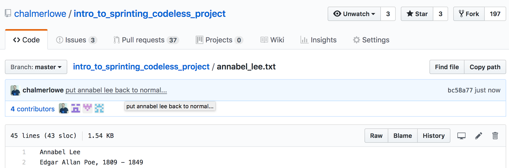

<!-- begin auto-generated title section --><!-- end auto-generated section -->

## Time-box

<XX> Minutes

## Overview

THIS FILE IS A WORK IN PROGRESS...

When working on open source projects you will often find yourself working with others on that same project, which means:

1. you will occasionally have to incorporate their changes into your local repository to see how the project may have evolved
1. some of the changes in that evolution will result in a conflict with your changes

If their changes are completely different from any changes we have made (i.e. if they modify File A, while we modify File B), then there should be no conflicts and it should be fairly trivial to merge the changes.  

Similarly, if their changes are in the same file that we changed, but are in completely separate portions of the file, we can often merge without conflict.

**But** if our changes are in the same file and overlap, it becomes difficult for `git` to automagically merge our changes. In those cases, `git` will turn over the merge process to us, to do manually, but will do its best to help.

## What to do

**Edit the file annabel_lee.txt on GitHub:**

Find the text file `annabel_lee.txt` on your GitHub fork.

Open `annabel_lee.txt` on GitHub **for editing** by clicking on the small pencil at far right side of the screen



Change just the first line by adding the letter `A` at the end of the line so that it looks something like this: (Please ensure you don't make any other changes to the file)

```bash
Annabel Lee A
```

**Create and switch to a new branch** called `annabel-merge`

```bash
$ git checkout -b annabel-merge
```

**Edit the file annabel_lee.txt locally:**
 
Open `annabel_lee.txt` in your local repository with a text editor. 

Change just the first line by adding the letter `B` at the end of the line, so it looks something like this:

```bash
Annabel Lee B
```

**NOTE:** ENSURE that you end up with two different changes in the two files, so that they won't match when you go to merge them.

**Add and commit your local changes**

In your local repo, run the following commands:

```bash
$ git add annabel_lee.txt
$ git commit -m "minor edit to annabel_lee.txt"
```

**Switch back to master**

```bash
$ git checkout master
```

**Pull down the changes you made on GitHub** by pulling from `master`

```bash
$ git pull
``` 

**Attempt to merge** the versions in your `master` branch and your `annabel-merge` branch using the `merge` command:

```bash
$ git merge annabel-merge
```

You should see an error message that looks like this:

```bash
$ git merge annabel-merge
Auto-merging annabel_lee.txt
CONFLICT (content): Merge conflict in annabel_lee.txt
Automatic merge failed; fix conflicts and then commit the result.
```

**Fix the conflict**

Open the file with a text editor and you should see that the file now includes text from both sources:

```
<<<<<<< HEAD
Annabel Lee # A        
=======
Annabel Lee # B
>>>>>>> annabel-merge
Edgar Allan Poe, 1809 - 1849

It was many and many a year ago,
   In a kingdom by the sea,   
```

Using your text editor, delete the lines that `git` added and any lines you don't want to retain. In this case, keep change B. Your final file should look like this:

```
Annabel Lee B
Edgar Allan Poe, 1809 - 1849

It was many and many a year ago,
   In a kingdom by the sea,   
``` 

**Add, commit and push** the newly revised file:

```bash
$ git add annabel_lee.txt
$ git commit -m cleaned up conflict
$ git push
``` 

## The big picture

<high-level concepts that can be described in a few minutes>

## Deep dive

<detailed explanations go here, with h3/h4 subsecitons if necessary>

## Resources

* [Git Branching - Basic Branching and Merging](https://git-scm.com/book/en/v2/Git-Branching-Basic-Branching-and-Merging)


<!-- begin auto-generated nav-links section --><!-- end auto-generated section -->
