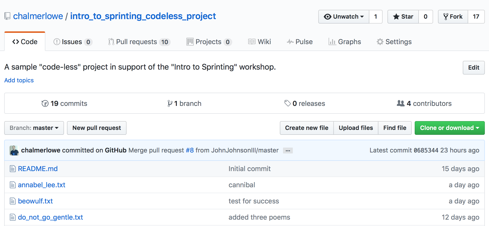

# GitHub Concepts

## Time-box

10 Minutes

## Overview

Github is a powerful platform. There are many features and capabilities available in Github. Let's review a handful of them

## What to do

1. Navigate to **your Github** repo for the codeless project.
1. The repo has a number of tabs across the top: `Code`, `Issues`, `Pull requests`, `Wiki`, `Graphs`, etc.

1. Click on the `Issues` tab. You will find a list of issues  

1. Click on several Issues and explore them: see the milestones, the labels, the commentary, etc.
1. Click on the `Wiki` tab. This is a great place to capture documentation and planning notes.

**NEXT** Navigate to the upstream Github repo for the codeless project, by clicking the small link under the name of the repo.

Look at each of the items above, but see how the **upstream repo** differs from and is similar to **your repo**.

<!-- TODO: Green sticky here -->

## The big picture

The tools seen above are intended to help improve the ability of team members to communicate and track changes and proposed changes to projects.

* If you find a problem in your repo you want help with OR you want to track, you may publish an Issue to let your colleagues know how they can help. If you find a problem in an open source project that you feel needs correcting, but you don't have time or expertise, you may submit an Issue on the upstream project repo.
* For this Intro to Sprinting workshop, if you have suggestions that would improve the learning experience, we urge you to submit Issues (or better yet, write up a possible edit > `git add` > `git commit` > `git push` and then move on to the next lesson and issue us a Pull Request so we can consider your ideas!).

## Deep dive

N/A

## Resources

N/A

| Previous | Up | Next |
|:---------|:---:|-----:|
| [Using GitHub](./github_overview.md) | [Using GitHub](./github_overview.md) | [Submitting a Pull Request](./github_submit_pull_request.md) |
