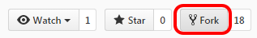
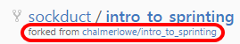
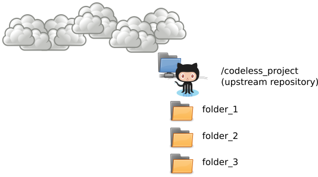

# Setting up GitHub

## Time-box

10 Minutes

## Overview

GitHub is a web-based version control repository. It also serves as an Internet hosting service. Github provides the functionality of `Git` (like distributed version control and source code management). It also offers bug tracking, task management, wikis, gists, feature requests and more. Github is the world's largest repository for source code. Github is used in tandem with `Git` to make changes, share changes, deal with conflicts and enable project participants to synchronize their work.

## Objectives

Through participating in this session, attendees will be able to:

* Understand why GitHub is used in an open source project
* Use some basic features of GitHub to prepare for contributing to a project, including creating a copy of the project

A later session will discuss features and capabilities of Github and will discuss additional steps in the open source process such as issuing a **pull request**, etc.

## What to do

### Login/create an account

If you **ALREADY** have a Github account, log into your regular account.

If you **DO NOT** have a Github account, you will need to make one:

1. Open your browser and navigate to the [GitHub Home Page](https://github.com/)
2. Fill out the form on the home page:
   * Pick a username (you will need a unique username)
   * Enter your email address
   * Create a password
3. Click "Sign up for GitHub"

### Get a copy of the project you want to work on

Fork the [Codeless Project](https://github.com/chalmerlowe/intro_to_sprinting_codeless_project/) into your GitHub acccount:

1. In the upper right hand corner, you'll see a **Fork** button: 

2. Click the Fork button to to create a fork under your account

**NOTE**:  The fork refers back to the original repo - if you look under your repo name, you'll see it's "forked from chalmerlowe/intro\_to\_sprinting\_codeless\_project:" 

## The big picture

Project files on Github are often called repositories, or a **repo** for short. For every project you contribute to, you will interact with two different repos:

* One repo will be the original project repository
* The other repo will be **your personal copy** of the original repo

When you want to work on a project, Github will enable you to **fork** the original project so that you can have a copy of the project under your account.

There are several nuances to understand about this:

* Your Github copy is exactly that: **your copy**.
* You can do whatever you want to your copy >> you can change it to suit your needs (within the limits of copyright/the license on the project).
* You do NOT have to explicitly share any of your changes back to the original author
* Github will maintain a link, behind the scenes, for you so that you can share your changes (we'll talk about that later)
* Unless they go looking, no one at the original repo will generally even know/notice about the specific details of your changes until you tell them about it. (Caveat: finding your changes is not hard, but there is generally no reason for folks to go looking).

## Resources

* [GitHub Bootcamp](https://help.github.com/categories/bootcamp/)
* [GitHub Help](https://help.github.com/)
* [Are git forks actually git clones?](http://stackoverflow.com/questions/6286571/are-git-forks-actually-git-clones)

| Previous | Up | Next |
|:---------|:---:|-----:|
| [Setting up Virtual Environments](./virtual_environments.md) | [Environment Set-up](./environment_overview.md) | [Setting up Git](./git_config.md) |
