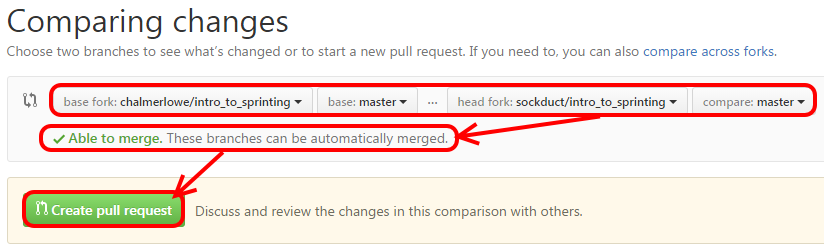

# Submitting a Pull Request

## Time-box

5 Minutes

## Overview

Once you have a change OR changes pushed to your Github repo, you will want to share those changes with the owner of the upstream project repository.

**NOTE**: This lesson presumes that your changes have been pushed to **your own** Github repo (instructions on how to do this were covered in a previous lesson: [Git Overview](./git_overview.md).

## What to do

1. Navigate to **your** Github repo in your browser.
1. Above the file list on the left hand side, click on the "New Pull Request" button: 

1. Github will allow you to confirm which changes in your repo you want to share with the original author, as shown in the following image.
   * **NOTE**: Github transfers you to the repo of the original author
   * You will **no longer** be on your own Github account page.
1. Before proceeding, you should check for the following items.
  * Confirm that the **head fork** is your fork
  * Confirm that the **base fork** is the original author's fork
  * Confirm that Github says: **Able to merge** (IF there are conflicts, refer to the [Git Overview](./lesson_05_git_overview.md) for instructions on how to fix this problem. 

1. Click on "**Create pull request**"
1. Follow these steps to prep the Pull Request for creation:
    * Write a Summary Title describing your changes (~50 characters or so)
    * Write a brief Description of what you're changing in this pull request
    * Click on "**Create pull request**" 

**REMINDER**:  This leaves you in the original author's repo (Chalmer Lowe in this case) and not your own!

## The big picture

As shown here, your repo has changes that need to be advertised to the upstream owner. Github uses the concept of a Pull Request to do this.

Whe you submit a Pull Request, the upstream owner will get a notification in Github and can then review all your suggested changes.

If they agree with and approve your **suggested changes** they will merge the changes into their project.

## Deep dive

N/A

## Resources

* [<resource name>](<resource url>)
* [<resource name>](<resource url>)

| Previous | Up | Next |
|:---------|:---:|-----:|
| [GitHub Concepts](./github_concepts.md) | [Using GitHub](./github_overview.md) | [Pull Request Tips and Suggestions](./pull_request_tips.md) |
