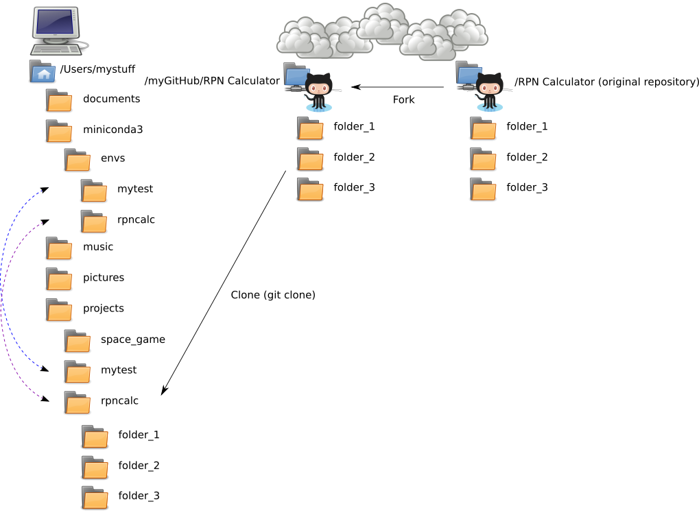

# Using Git

## What is git?

Git is a version control system - it enables you to control the various versions of projects, such as open source projects.

Version control systems, along with managing changes to projects, help ensure every contributor is working on the same codebase.

Git is a tool that makes it easy to contribute to projects that other people are
working on. The project code lives in a central **remote repository**, traditionally called
`origin`. Programmers copy the project into their own **local repository**,
where they can work on adding features and squashing bugs. When finished, they
push the code back into `origin`, for other contributers to see and pull from.

# Objectives

Through participating in this session, attendees will be able to:

* Understand why git is used in an open source project
* Use basic git commands to:
    * configure git for use
    * get a copy of an open source project
    * save modifications/additions/deletions to the project
    * submit those changes to the project
    * incorporate other's changes to the project
    * verify the status of the project repository
    * perform basic troubleshooting

**NOTE**: this will be a **hands-on** overview of git. It is incredibly powerful with many options and capabilities. The goal is to get you **started** with git, but it will take time and practice on your own to make you into an expert.

# Lecture and Demos

## Introduce yourself to the command line

`git` is a command-line tool, and as such you will be doing a lot of typing when you work with it.  

If you need a primer for the command line, check out the [free course on Codecademy](https://www.codecademy.com/learn/learn-the-command-line). If you just need a quick reference, check out the [Linux commands cheat sheet on It's Foss](https://itsfoss.com/linux-commands-cheat-sheets/).

### GUI-based git tools

There are GUI tools available as well, but they are beyond the scope of this project.

* [gitk](https://lostechies.com/joshuaflanagan/2010/09/03/use-gitk-to-understand-git/)
* [SourceTree](https://www.sourcetreeapp.com/)

... and there are many others.


## Introduce yourself to git

When you contribute to a project, you'll want your name associated with your contributions. The following commands allow git to get to know you:

```bash
git config --global user.name "<Your Name here>"
git config --global user.email "<your_email@domainname.com>"
```

**Note:** You'll only need to do this once on your computer.

## The big picture

Before you can start adding to a project, you will need to clone the project to your local computer in your local working directory.




## Clone a project

We're presuming you've already read the [github\_overview](./lesson_04_github_overview.md), and have forked the [Intro to Sprinting Codeless Project](https://github.com/chalmerlowe/intro_to_sprinting_codeless_project) into your own Github repository. IF NOT, go do that now.

Now, you're ready to contribute. It's time to clone the project, so you have a copy on your machine to do work on.

Enter the following command on the command line, **ENSURE that you change `<your_username>`** to the name of your account:

```bash
git clone https://github.com/<your_username>/intro_to_sprinting_codeless_project.git
```

This command creates a folder, which should be full of project files. Git will automatically set up `origin` as a **remote** repository, which points to **your** fork of the repository.

Next we inform git of where to find the upstream repository (the repo that your fork was forked from) using the following command:

```bash
git remote add upstream https://github.com/chalmerlowe/intro_to_sprinting_codeless_project.git
```

Confirm that git has stored the correct upstream repository with this command:

```bash
git remote -v
```

**Note:** You'll do this **one time for each project** you want to work on.

## Git concepts

Git repositories are very sophisticated, but at the lowest level, they are fairly simple. Git tracks changes to files in a database AND categorizes files in the following ways:

1. Local directory (warehouse)
2. Staging area (pallet)
3. Commit (truck)
4. Remote (remote warehouse shared by all, typically called "origin")

As we look at each of these, we will imagine that we are processing materials in a warehouse and shipping them to another location.

### Local directory

The **local directory** is simply the directory on your machine and it contains all your files, drafts, completed work, incomplete work, tools, etc. This material is uniquely yours. We can consider this to be the warehouse in our example. There are plenty of materials: some that are necessary to run the warehouse (but not part of what is typically stored in the warehouse), some things that have been ordered, and some things that are not quite ready to ship. Any new files you create in your local directory will only be visible to you.

### Staging area

The **staging area** holds all the files that are ready to added to the project and shared with others. The staging area can be compared to the pallet in our example. Everything that is 'done' and ready to be loaded on the truck gets placed on the pallet. To put a file into the staging area (i.e. add  it to the pallet), you will use the `git add` command (described below). Just like a pallet, you can continue to add files to the pallet, essentially indefinitely. When you are done making all the changes you want to, you move the pallet into the truck. While things are still in the staging area (on the pallet), it is fairly easy to add more files, remove files, change files, etc.


#### The big picture


**NOTE**: if you add a file to the staging area and **THEN** make additional changes to the file, you will need to add the file a second time to capture the newest changes.

### Commit

The **commit area** holds all the changes that you are going to release to the original author. The commit area can be compared to the truck in our example. Once your pallet is full, you load it onto the truck for delivery. Everything that is ready to be shipped goes into the commit area (gets loaded on the truck). To commit a file, you will use the `git commit` command (described below).

#### The big picture


**NOTE**: much like we saw above...if you edit something that has been committed, then the new changes will not be released to the original author. Any new changes will have to be added to the staging area and then committed.

### Remote

A **remote** is some other repository other than the local copy on your computer; this is typically stored somewhere like GitHub but can be just about anywhere. Remotes are named, and the default name for the first remote is **origin**. Another remote name you will hear often if you're submitting code to other people's projects is **upstream**, which usually refers to the original project you forked from.

Nothing gets moved off your local system until you `git push` it to a remote repository. Only items that have been committed are pushed to a remote. Pushing to `origin` (the default remote when you clone from GitHub, for example) can be compared to the truck driving away to deliver the pallet. Once changes have been pushed, they are published and others can see those changes in your Github repository.

#### The big picture


Below, we will see how you move files from category to category.

### Checking the status of everything

There is a simple way to see what status every file is in: `git status`. Don't try this yet (we'll do it soon), just read the various types of status messages you will encounter regularly and see if you can make sense of them:

```bash
$ git status
On branch master
Your branch is up-to-date with 'origin/master'.
nothing to commit, working tree clean
```

This tells you that right now your local copy matches what your computer last heard is on the server... everything is **clean**.

If you have locally changed files that are in a **working** state (not yet staged), you will see something like this:

```bash
$ git status
On branch master
Your branch is up-to-date with 'origin/master'.
Changes not staged for commit:
  (use "git add <file>..." to update what will be committed)
  (use "git checkout -- <file>..." to discard changes in working directory)

	modified:   README.md

no changes added to commit (use "git add" and/or "git commit -a")
```

This says the file called "README.md" is changed locally but not yet staged. Note particularly that there are several helper messages in there: they tell me how to **add** it and how to **revert** it (get it back to the way it was before I made my change) should I want to do those things.

Next I want to move the file to staging (**add** it):

```bash
$ git add README.md
$ git status
On branch master
Your branch is up-to-date with 'origin/master'.
Changes to be committed:
  (use "git reset HEAD <file>..." to unstage)

	modified:   README.md
```

Now I can see that the file is **staged**, but not yet **committed**. I can also see what to type to move it back to an unstaged state.

Next I want to commit the file:

```bash
$ git commit -m 'my short description of the work'
[master 206546b] my short description of the work
 1 file changed, 1 insertion(+), 1 deletion(-)

$ git status
On branch master
Your branch is ahead of 'origin/master' by 1 commit.
  (use "git push" to publish your local commits)
nothing to commit, working tree clean
```

Here, like earlier, my working tree is again **clean** (all changes are committed). However, unlike before, I have some changes in my local repository that are not yet on the remote server. Like all other status messages, I can see what to type to push the file up to Github.

I can push that file:

```bash
$ git push
Counting objects: 3, done.
Delta compression using up to 4 threads.
Compressing objects: 100% (3/3), done.
Writing objects: 100% (3/3), 284 bytes | 0 bytes/s, done.
Total 3 (delta 2), reused 0 (delta 0)
To github:myusername/my_repo.git
   98b2f3f..206546b  master -> master

$ git status
On branch master
Your branch is up-to-date with 'origin/master'.
nothing to commit, working tree clean
```

... and everything is clean again, but now with my local change pushed to GitHub and available to the world.

Get in the habit of using `git status` regularly, it is probably the most informative and helpful command for understanding exactly what's going on.

## Common Operations


### Seeing what you've changed

It can be very helpful to see what's different between the file you are working on and the last-committed version. To do this, use the `git diff` command.

`git diff` represents changes in a manner referred to generally as "diff format". This format most basically represents all changes as the addition or removal of lines from files.

**Note:** the examples below are in black/white, but in most command-line environments (`bash`, for example) they will also be color-coded to help make them easier to read.

If I add a line to a file, I'll see something like this:

```bash
$ git diff
diff --git a/rpncalculator/parser.py b/rpncalculator/parser.py
index 90cd3cd..e22a262 100644
--- a/rpncalculator/parser.py
+++ b/rpncalculator/parser.py
@@ -39,6 +39,7 @@ class Parser(object):
         """scan input stream and return token generator"""
         if isinstance(stream, str):
             stream = StringIO(stream)
+        print(str(stream))
         for line in stream:
             tokens, remainder = _scanner.scan(line)
             for t in tokens:
```

The first part of the output shows me which file is being displayed. The output from `git diff` can contain many files; you can specify individual files or groups of files by providing the file name(s) to git diff with `git diff <file1> <file2> ...`. Even with a single file specified, the output will always tell you which file(s) are being compared with each change.

The line that starts with `+` indicates that line is new compared to what's currently committed. Also note that the tool shows me a few lines before and after the change to help me see the context of the change.

Also you can see which line number(s) are involved in the change. The `@@` line tells you that line 39 is the affected line. There are two line numbers there because changes to multiple places in a file can mess up your idea of line numbers. Just remember that the first number is the line in the original file and the second number is the line in the modified file.

Similarly, if I remove a line:

```bash
$ git diff
diff --git a/rpncalculator/parser.py b/rpncalculator/parser.py
index e22a262..90cd3cd 100644
--- a/rpncalculator/parser.py
+++ b/rpncalculator/parser.py
@@ -39,7 +39,6 @@ class Parser(object):
         """scan input stream and return token generator"""
         if isinstance(stream, str):
             stream = StringIO(stream)
-        print(str(stream))
         for line in stream:
             tokens, remainder = _scanner.scan(line)
             for t in tokens:
```

Here, the `-` shows me the line that was removed.

If I *change* a line, it will show as a removed line and an added line:

```bash
$ git diff
diff --git a/rpncalculator/parser.py b/rpncalculator/parser.py
index e22a262..b186e9a 100644
--- a/rpncalculator/parser.py
+++ b/rpncalculator/parser.py
@@ -39,7 +39,7 @@ class Parser(object):
         """scan input stream and return token generator"""
         if isinstance(stream, str):
             stream = StringIO(stream)
-        print(str(stream))
+        log.debug(str(stream))
         for line in stream:
             tokens, remainder = _scanner.scan(line)
             for t in tokens:
```

Here you can see that I changed the print() call to a log.debug() call.

A file with multiple changes would look like this:

```bash
$ git diff
diff --git a/rpncalculator/parser.py b/rpncalculator/parser.py
index e22a262..7e8bf4a 100644
--- a/rpncalculator/parser.py
+++ b/rpncalculator/parser.py
@@ -39,7 +39,7 @@ class Parser(object):
         """scan input stream and return token generator"""
         if isinstance(stream, str):
             stream = StringIO(stream)
-        print str(stream)
+        log.debug(str(stream))
         for line in stream:
             tokens, remainder = _scanner.scan(line)
             for t in tokens:
@@ -50,6 +50,7 @@ class Parser(object):
         if not engine:
             engine = Engine()
         result = None
+        log.debug(str(stream))
         for token in self.scan(stream):
             if isinstance(token, float) or isinstance(token, int):
                 result = engine.push(token)
```

Here I can see that I changed line 39 from a `print()` to `log.debug()` and that I also added a new `log.debug()` call at line 50.

Many GUI-based tools will show you more information, such as highlighting the individual characters in a line that were changed. Since this varies from tool to tool, it won't be covered in detail here.

### Adding

There are couple tricks that makes adding files to a commit a little bit easier if you pay attention to what you are doing. For instance you can add all of the changed files to your staging area with:

```bash
git add *
```

You can add all changed files from the current directory using:

```bash
git add .
```

**NOTE**: This can lead to problems if you add files that aren't related to the commit. To protect against this you can view which files have pending changes before you add them with:

```bash
git status
```

### Committing

The method taught above works fine, but there are additional flags and parameters that can make for a better commit. First of all, if you would like to add a more in depth description you can use:

```bash
git commit
```

This command will bring you into a command line text editor like **vi/vim** or **emacs** where the
first line serves as the title of the commit, followed by a blank line and then you can add a paragraph-style description.

Another feature related to that, which ties in with open source sprinting is if you enter

```bash
git commit -s
```

It will bring of the same command line text editor as before but with a `Signed off by:` section
listing your name, giving the rights to your code to whomever you committed it to.


### Pushing

The `git commit` command notes your changes locally, but they are not yet changed on the **origin (remote repository)**. To push your changes up to GitHub, you use the `git push` command:

```bash
git push <repository_name> <branch_name>
```

The repository will generally be `origin` (the conventional name for your primary repository), but does not have to be. In this case we worked on the main branch which is called `master` by default.

This command can be condensed to simply  `git push` if you are pushing to `origin` on the branch that is currently active in Git (in this case `master`).

### Branching and Merging

With larger projects, it is very common to create **branches** and then **merge** the branch into the main project when you make changes. You've seen references to `master` above, the default branch. A typical enhancement would be done by:

1. creating a branch (so you have a separate workspace to work in) using `git checkout -b <branch name>`
1. doing your work as a series of `git add`, `git commit` cycles to the branch, as described above
1. merging your changes back into master

By following this pattern, you keep your work isolated from the rest of the project until it is ready to be released. Examples include:

* creating new features
* experimenting with changes to the code
* fixing bugs

Branches should be small and self-contained so that they can be merged. Sprawling and convoluted changes to code can make it nearly impossible to merge. In addition, it is customary for branches to be focused on specific problems: i.e. one bug fix per branch OR one new feature per branch.

A typical iteration of creating a feature (sometimes called a `feature branch`) would look like this:

```bash
git checkout -b my-feature-name     # "-b" creates a new branch named "my-feature-branch"

# <do some work in my editor or IDE>

git add .
git commit -m 'my first bit of work'
# <do more work in my editor or IDE>

git add .
git commit -m 'my second bit of work'

git checkout master     # this checks out the master branch              
git merge my-feature-name
git push origin master
```

Let's imagine that you are working on a project with multiple commits to the master branch and a single bug fix branch to fix Issue #53 called `iss53`. Commits `C3` and `C5` are the changes that were committed on the branch, and `C4` is a change made by someone else to the master branch during that same timeframe.

The history created by the above steps would look something like this:


**Source**: http://sentheon.com/images/27052016_branches.png

# Hands-on

## Making changes to files

After cloning the code from your fork you are free to create and expand upon the
project. Once you have completed something sizeable, be it a feature, function,
or documentation, it is time to commit.

For now, let's edit the `all_student_names.txt` file, by adding your name to the line with your student number. (The instructor will provide you with a student number).

1. Change directories on your computer until you are in the top-level folder for the repository. If you type `ls` (or `dir` in Windows) you should see a file called `all_student_names.txt`.
2. Edit the `all_student_names.txt` file, adding your name, as described above, and save the file.
3. Check the current status of all files in the repository:

```bash
$ git status
On branch master
Your branch is up-to-date with 'origin/master'.
Changes not staged for commit:
  (use "git add <file>..." to update what will be committed)
  (use "git checkout -- <file>..." to discard changes in working directory)

	modified:   all_student_names.txt
```

3. **Add** the `all_student_names.txt` file to the git **staging area**.

    ```bash
    git add all_student_names.txt
    ```

    If you need to add more than one file to the staging area, simply separate the filenames with a space:

    ```bash
    git add <file1> <file2> ...
    ```
    
    ... or you can add groups of files using standard [globbing](https://en.wikipedia.org/wiki/Glob_(programming)):
    
    ```bash
    git add *.txt
    ```

4. After adding the files you changed it is time to **commit** them. It is customary to add a description message (using the `-m` option) describing your changes, when you commit.

    ```bash
    git commit -m "Description of changes"
    ```
    **NOTE**: commit messages should be short (typically 50 characters or less). See the Resources below for more details on commit messages.

5. Lastly, you are going to have to send the commit to Github or another Source Code Manager with:

    ```bash
    git push origin master
    ```

    In this case, you are pushing your master branch to **origin** (the **remote repository**). We'll discuss branching in more depth later.

After pushing to origin you will have to go and create a pull request, which is explained in the [github\_overview](./lesson_04_github_overview.md).

## Make a change in a branch

Here we will make another change, but using the branch-work-merge flow to isolate our work from changes made by others.

### Create a branch

**Note:** replace "my\_change\_name" with the name of the feature you are adding.

```bash
git checkout -b feature/my_change_name
```

### Make your changes

Open your favorite editor or IDE and make the changes desired. Perhaps you want to add a new file with your favorite poems or joke?

When you are finished making changes, proceed with the remaining steps.

### Commit your changes

```bash
git add .
git commit -m 'added my new feature'
```

### Merge changes from master into your branch

Sometimes other people will make changes that impact the thing you were working on. It's easiest to catch this early by trying to merge **master** into your feature branch:

```bash
git merge master
```

If you have any conflicts, you will need to address them. GitHub has a simple resource for [resolving conflicts](https://help.github.com/articles/resolving-a-merge-conflict-using-the-command-line/). A full discussion of conflict resolution is beyond the scope of this lesson.

### Merge your changes into the master branch

```bash
git checkout master
git merge feature/my_change_name
```

### Delete your feature branch

```bash
git branch -d feature/my_change_name
```

# Resources

To learn more about git, try these resources:

## Documentation and Books:

[Pro-Git](https://git-scm.com/book/en/v2), a free online resource (and in [PDF](https://progit2.s3.amazonaws.com/en/2016-03-22-f3531/progit-en.1084.pdf) form to save to your computer) with comprehensive documentation about using git well by Scott Chacon and Ben Straub

[User Manual](https://git-scm.com/docs/user-manual.html)

## Tutorials and videos:

[Interactive Tutorial](https://try.github.io/levels/1/challenges/1)

[A Successful Git Branching Model](http://nvie.com/posts/a-successful-git-branching-model/), which describes the branching model used by a variety of large and small projects; some projects do this differently, but the basic ideas are common with all of them

[Written Tutorial](https://git-scm.com/docs/gittutorial)

[Git Happens](https://youtu.be/yCh6TSLIQBQ) video by Jessitron (Jessica Kerr) that uses the warehouse analogy to help clarify directory, staging, commit

[Video collection](https://git-scm.com/videos)

[50/72 rule for git commit messages](http://stackoverflow.com/questions/2290016/git-commit-messages-50-72-formatting) How to format git commit messages efficiently

## Reference Manuals:

[Official Reference Manual](https://git-scm.com/docs)

[Git cheatsheet](https://education.github.com/git-cheat-sheet-education.pdf)

|[<<< Previous Lesson: GitHub Overview](./lesson_04_github_overview.md)|[Next Lesson: GitHub Part Deux >>>](./lesson_06_github_part_deux.md)|
|:--|--:|
