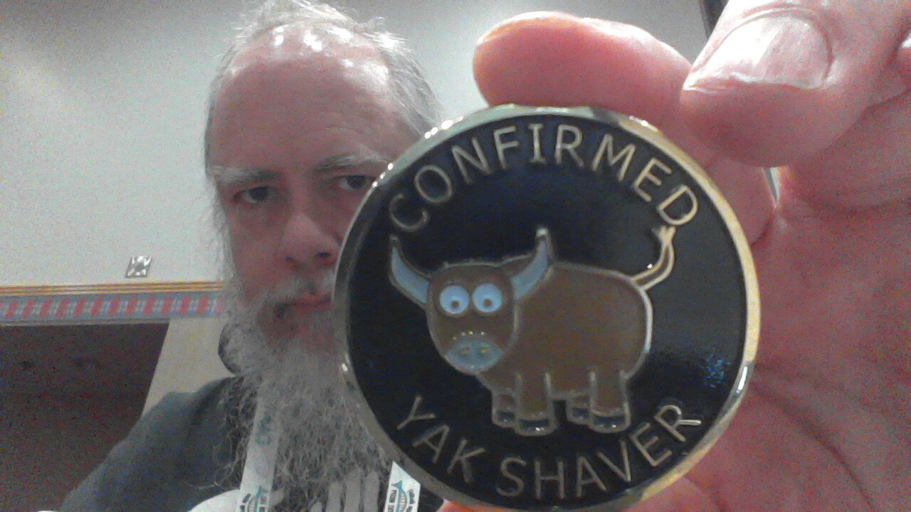

<!-- begin auto-generated title section -->
# Course Overview and Preparation
<!-- end auto-generated section -->

## Overview

Welcome to the **Introduction to Open Source Workshop**. Participants are expected to walk away with enough knowledge to be able to participate in a typical open source project. The workshop has a mixture of hands-on exercises and lecture/demos, with the focus on hands-on activities.

### What to expect

This workshop covers...

* [Installing software](./installing_tools.md): basic installation of the version control software Git.
* [Using Git](./git_overview.md): basic commands to copy a repository, add your changes, commit those changes and push the changes to Github.
* [Using GitHub](./github_overview.md): basic overview of the collaborative tools on GitHub and how to issue a pull request.
* [Practicing your skills](./for_realz.md): A chance to practice these skills on a project on GitHub.

If you have time to move beyond Git, this workshop also covers:

* [Working with Real Projects](./projects_with_code.md): Installing software and creating a working environment for a few real-world scenarios.

### What not to expect

This workshop does **not** cover...

* How to program
* Programming in any specific language

This is not a programming workshop, nor is it a Python workshop. It is intended to prep students to contribute to open source projects; it is not intended to teach students how to program.

The example code in this version of the workshop is written in Python, but this project can be run using an example project in another programming language, if desired.

## Learning objectives

Participants should expect to achieve the following learning objectives upon completing this workshop:

* Be able to install the following software: `conda`, `git`, etc.
* Be able to use `git` and GitHub to create a copy of an open source project on their own computer
* Upon editing, adding, or deleting content in a project:
  * incorporate any changes to the project, made by others, into their own local copy
  * correct any conflicts between their changes and others' changes
  * successfully issue a request for their contribution to be added to the open source project
* Be able to create a virtual environment (if working in Python)

Ultimately, the goal is to help you overcome some of the hurdles inherent in successfully contributing to an open source project...

## Testimony/Feedback...

> "...after nearly 60 years, an Open Hatch workshop, and two PyCon "How to Sprint" workshops, I think I'm beginning to get the hang of things. ;-)

> I'm a BeeWare developer.​​ I have a new job title: Confirmed Yak Shaver. And I have the coin of the realm to prove it. ;-)"

> **Kevin Cole**

## Preparatory Lessons

* [Instructor Preparation](./prereq_instructor.md): Steps the instructor should take to prepare for the workshop.
* [Student Preparation](./prereq_student.md): Steps the students should take to prepare for the workshop.

<!-- begin auto-generated nav-links section -->
| Previous | Up | Next |
|:---------|:---:|-----:|
| [Table of Contents](./README.md) | [Table of Contents](./README.md) | [Instructor Preparation](./prereq_instructor.md) |
<!-- end auto-generated section -->
