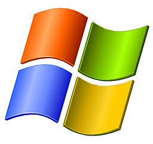

<!-- begin auto-generated title section -->
# Setting up Python Environments
<!-- end auto-generated section -->


# NOTE

This section is still a work in progress. If you want to get up and running quickly with python, we suggest you use the instructions in [Setting up Virtual Environments for Data Science Work](./setup_data_science.md).

** TODO ** : switch to `pipenv` by default


## Time-box

15 Minutes


## Overview

Virtual environment tools enable you to create a standalone environment for your project so that you can avoid conflicts between one project and another in terms of software versions (e.g., `python 2.7` or `python 3.6`) as well as the versions of other libraries that your project might depend upon.

### Objectives

Through participating in this session, attendees will be able to:

* Identify what a virtual environment is AND when using a virtual environment is a suitable solution to a task
* Create a virtual environment
* Populate a virtual environment with the software necessary to complete a programming/development task


## What to do

* Make sure you have `python` or `python3` installed:

```bash
$ python --version
3.7.1
```

* Install the `virtualenv` package:

```bash
$ pip install virtualenv
```

* Make sure you are in a directory where you want your project folder to be located (many people put this in their `My Documents` OR `home` folder. From that directory, run the following command:

```bash
$ mkdir mytest
```

* Change directories into the new folder:

```bash
$ cd mytest
```

* Create a virtual environment with your default python:

```bash
$ virtualenv venv
```

* Activate your virtual environment using the command appropriate to your operating system:

####  Mac/ Linux

```bash
$ source venv/bin/activate
```

####  Windows

```bat
C:\> # TODO: need the windows command for this
```

* Install two additional packages to your virtual environment (as a suggestion, try `ipython` and `mock`) using the following command:

```bash
$ pip install ipython mock
```

## Done with commands for now!

If you (if you're working in pairs, you and your partner) are done, then now you can put your green sticky up! This is how we know you're done with the commands.


If you like reading, you can also keep reading this page.

## The big picture

One area of confusion that often comes up when working on open source comes from the fact that at any given time, there may be multiple copies of the code (on your local computer, in your GitHub repository OR in the original project's repository).

**TODO**: needs a description and imagery for using python virtualenvs this way

## Deep dive

### What is a virtual environment?

As mentioned above, virtual environments (also called virtualenvs) are tools used to keep projects separate, especially in terms of keeping different software versions separate and different library versions separate. For example, virtualenvs prevent Python's site packages folder from getting filled with potentially conflicting versions of software AND thus prevents problems that arise when one project needs **version x.x** of a library but another project needs **version y.y** of the same library. At their core, virtualenvs are glorified directories that use scripts and metadata to organize and control the environment. You are allowed to have an essentially unlimited number of virtualenvs. And as you saw above, they are very easy to create using various command line tools, such as `virtualenv`.

### When should we use a virtual environment?

Anytime you have more than one project and there is a possibility of conflicts between your libraries, it is a good time to use a virtualenv. Having said that, many programmers use virtual environments for **all but the most trivial** programming tasks. Especially for beginners, using virtualenvs early on in your learning career will build a valuable skill AND help prevent sneaky bugs related to version discrepancies. Bugs that can be hard to diagnose.

### How do you create a virtual environment?

While there are several programs or libraries that can generate virtualenvs (see the [Resources](#resources) section for a list). For today's lesson, we will be using the `virtualenv` package manager, which includes the capability to simply and easily produce virtualenvs.

Presuming you have `virtualenv` installed, these steps enable you to create and activate a virtual environment.

```bash
# NOTE this probably isn't right for Windows
$ virtualenv venv --python=$(which python3)
```

Description:

* `virtualenv` runs the virtual environment creation program.
* `venv` is the name of the directory to use for the virtualenv
* `--python=$(which python3)` tells `virtualenv` that you want to install Python version 3 in this virtualenv
    * by default, `virtualenv` will install whichever version of python you have set as the default (run `python --version` to see which version this is)


### Activating a virtualenv

Once you have created a virtual envvironment, you will need to activate it. Activation has several side effects:

* It temporarily changes your `$PATH` variable so calls to the `python` command (and similar commands) will look first in the virtualenv's `bin/` directory. 
* It temporarily changes your shell prompt to show which virtualenv you are using. Your prompt will likely look something like this, with the name of your virtualenv in parenthesis in front of the prompt:
    * Mac/Linux: `(mytest) $`
    * Windows: `(mytest) C:\>`

To activate your virtualenv, make sure you're in your project directory and run the appropriate command for your operating system:

#### Mac/Linux

```bash
$ source venv/bin/activate
```

#### Windows

```bat
C:\> # TODO: need the right windows command
```

**Note:** If you are using Power Shell, `activate` won't work out of the box. Type `cmd` first to get a regular command prompt, *then* `activate mytest`.

### Adding software to your virtualenv 

To add more software to the virtualenv, you can use `pip` to install the software. The maintainers of `setuptools` (of which `pip` is a part) provide access to many Python and non-Python libraries via [PyPI](https://www.pypi.org), but not all of them. You can also use `pip` to install libraries directly from GitHub (if you need a particular commit of a package, for instance), but this is outside the scope of this lesson.

For example, to install IPython, you can use the following `pip` command:

```bash
(venv) $ pip install ipython
```

Pip will prepare to install IPython and any dependencies that IPython relies upon. It will display output similar to the following (truncated to save space).

```bash
$ pip install requests
Collecting requests
 ...
 ...
Installing collected packages: chardet, urllib3, idna, certifi, requests
Successfully installed certifi-2018.8.24 chardet-3.0.4 idna-2.7 requests-2.19.1 urllib3-1.23
```

#### Multiple packages

Multiple packages can be installed at the same time, by separating the package names with spaces:

`pip install flake8 mock funcsigs`

### Leaving the virtualenv when you are done

When you are done working in your virtualenv, you can deactivate it using the following command:

#### Mac/Linux

```bash
(mytest) $ deactivate
$
```

#### Windows

```bat
(mytest) C:\> deactivate
C:\>
```


## Resources

* [Installing packages using pip and virtualenv](https://packaging.python.org/guides/installing-using-pip-and-virtualenv/): A getting started guide on how to use Python's built-in `virtualenv` tool
* [pip instructions](https://docs.python.org/3/installing/): An overview of a Python-oriented package manager: Pip

<!-- begin auto-generated nav-links section -->
| Previous | Up | Next |
|:---------|:---:|-----:|
| [Working with Real Projects](./projects_with_code.md) | [Working with Real Projects](./projects_with_code.md) | [Setting up Data Science Environments](./setup_data_science.md) |
<!-- end auto-generated section -->
