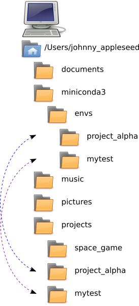

# Setting up Virtual Environments


## Time-box

15 Minutes


## Overview

Virtual environment tools enable you to create a standalone environment for your project so that you can avoid conflicts between one project and another in terms of software versions (ie. `python 2.7` or `python 3.6`) as well as the versions of other libraries that your project might depend upon.

### Objectives

Through participating in this session, attendees will be able to:

* Identify what a virtual environment is AND when using a virtual environment is a suitable solution to a task
* Create a virtual environment
* Populate a virtual environment with the software necessary to complete a programming/development task


## What to do

* Create a directory for your project, in this case, we will create a directory called `mytest`
* On your command prompt, make sure you are in a directory where you want your project folder to be located (many people put this in their `My Documents` OR `home` folder. From that directory, run the following command:

```bash
$ mkdir mytest
```

* Change directories into the new folder:

```bash
$ cd mytest
```

* Create a virtual environment with Python 3, using the following command:

```bash
$ conda create -n mytest python=3
```
* Activate your virtual environment using the command appropriate to your operating system:

#### Mac/Linux

```bash
$ source activate mytest
```

#### Windows

```bat
C:\> activate mytest
```

* Install two additional packages to your virtual environment (as a suggestion, try `ipython` and `mock`) using the following command:

```bash
conda install ipython mock
```

## Done with commands for now!

If you (if you're working in pairs, you and your partner) are done, then now you can put your green sticky up! This is how we know you're done with the commands.


If you like reading, you can also keep reading this page.

## The big picture

One area of confusion that often comes up when working on open source comes from the fact that at any given time, there may be multiple copies of the code (on your local computer, in your Github repository OR in the original project's repository).

Throughout this workshop, we will do our best to help highlight which copy of the code we are working with via a series of pictures. Specifically, we will identify when we are interacting with local files OR with our Github Repository OR with the original project's repository, etc.

For this lesson, we image a fairly typical directory/folder structure on your local computer. In this picture, NOTE that we have:

* a directory for your **project(s)** to be saved in
* a directory associated with **miniconda**


When you create a virtualenv, conda will add subdirectories to the miniconda directory. Specifically it will create a directory that will contain:

* a database and metadata about the virtualenv
* software and libraries related to the project (i.e. Python and any modules you install in the virtualenv)

NOTE: these folders are **NOT** duplicates of each other, but they **ARE** tied to one another. 
NOTE: The miniconda virtualenv folders will **NOT** contain your project code.




## Deep dive

### What is a virtual environment?

As mentioned above, virtual environments (also called virtualenvs) are tools used to keep projects separate, especially in terms of keeping different software versions separate and different library versions separate. For example, virtualenvs prevent Python's site packages folder from getting filled with potentially conflicting versions of software AND thus prevents problems that arise when one project needs **version x.x** of a library but another project needs **version y.y** of the same library. At their core, virtualenvs are glorified directories that use scripts and metadata to organize and control the environment. You are allowed to have an essentially unlimited number of virtualenvs. And as you saw above, they are very easy to create using various command line tools, such as `conda`.

### When should we use a virtual environment?

Anytime you have more than one project and there is a possibility of conflicts between your libraries, it is a good time to use a virtualenv. Having said that, many programmers use virtual environments for **all but the most trivial** programming tasks. Especially for beginners, using virtualenvs early on in your learning career will build a valuable skill AND help prevent sneaky bugs related to version discrepancies. Bugs that can be hard to diagnose.

### How do you create a virtual environment?

While there are several programs or libraries that can generate virtualenvs (see the [Resources](#resources) section for a list). For today's lesson, we will be using the `conda` package manager, which includes the capability to simply and easily produce virtualenvs.

Presuming you have `conda` installed, these steps enable you to create and activate a virtual environment.

```bash
$ conda create -n mytest python=3
```

Description:
* `conda` runs the conda program.
* `create` tells it to create a virtualenv
* `-n` identifies the name of the virtualenv, in this case, `mytest`
* `python=3` tells conda that you want to install Python version 3 in this virtualenv

**NOTE**: you can use version 2.x or version 3.x of Python and regardless which you choose, conda will default to the most recent version of Python. Sorta... [see footnote 1](#footnotes). If you need to select a specific minor version of python, use the following syntax:

`python=3.2`

When you execute the `conda create` command, `conda` prepares to install Python and any dependencies that Python relies upon. It will display output similar to the following. 

```bash
MacComputer:intro_to_sprinting username$ conda create -n mytest python=3
Fetching package metadata .......
Solving package specifications: ..........

Package plan for installation in environment /Users/username/miniconda3/envs/mytest:

The following packages will be downloaded:

    package                    |            build
    ---------------------------|-----------------
    openssl-1.0.2k             |                1         3.0 MB
    python-3.6.0               |                0        11.7 MB
    setuptools-27.2.0          |           py36_0         523 KB
    wheel-0.29.0               |           py36_0          87 KB
    pip-9.0.1                  |           py36_1         1.7 MB
    ------------------------------------------------------------
                                            Total:        17.0 MB

The following NEW packages will be INSTALLED:

    openssl:    1.0.2k-1
    pip:        9.0.1-py36_1
    python:     3.6.0-0
    readline:   6.2-2
    setuptools: 27.2.0-py36_0
    sqlite:     3.13.0-0
    tk:         8.5.18-0
    wheel:      0.29.0-py36_0
    xz:         5.2.2-1
    zlib:       1.2.8-3

Proceed ([y]/n)?
```

To finish the creation of the virtualenv and install the software, press `y`.

### Activating a virtualenv

Once you have created a virtualenv, you will need to activate it. Activation has several side effects:

* It temporarily changes your `$PATH` variable so calls to the `python` command (and similar commands) will look first in the virtualenv's `bin/` directory. 
* It temporarily changes your shell prompt to show which virtualenv you are using. Your prompt will likely look something like this, with the name of your virtualenv in parenthesis in front of the prompt:
    * Mac/Linux: `(mytest) $`
    * Windows: `(mytest) C:\>`

To activate your virtualenv, run the appropriate command for your operating system:

#### Mac/Linux

```bash
$ source activate mytest
```

#### Windows

```bat
C:\> activate mytest
```

**Note:** If you are using Power Shell, `activate` won't work out of the box. Type `cmd` first to get a regular command prompt, *then* `activate mytest`.

### Adding software to your virtualenv 

To add more software to the virtualenv, you can use `conda` to install the software. The maintainers of conda provide access to many Python and non-Python libraries, but not all of them. If conda cannot install a particular library that you need, you can generally use `pip` or a similar package installation tool to install it instead (covering `pip` is outside the scope of this workshop).

For example, to install IPython, you can use the following `conda` command:

```
conda install ipython
```

Conda will prepare to install IPython and any dependencies that IPython relies upon. It will display output similar to the following (truncated to save space).

```bash
Fetching package metadata .......
Solving package specifications: ..........

Package plan for installation in environment /Users/chalmerlowe/miniconda3:

The following packages will be downloaded:

    package                    |            build
    ---------------------------|-----------------
    conda-env-2.6.0            |                0          601 B
    ...
    ipython-5.3.0              |           py35_0        1021 KB
    conda-4.3.14               |           py35_0         505 KB
    ------------------------------------------------------------
                                            Total:         3.8 MB

The following NEW packages will be INSTALLED:

    appnope:          0.1.0-py35_0
    ...
    wcwidth:          0.1.7-py35_0

The following packages will be UPDATED:

    conda:            4.1.11-py35_0 --> 4.3.14-py35_0
    conda-env:        2.5.2-py35_0  --> 2.6.0-0
    requests:         2.10.0-py35_0 --> 2.13.0-py35_0

Proceed ([y]/n)?
```

To finish the installation of IPython and its dependencies, press `y`.

#### Multiple packages

Multiple packages can be installed at the same time, by separating the package names with spaces:

`conda install flake8 mock funcsigs`

### Leaving the virtualenv when you are done

When you are done working in your virtualenv, you can deactivate it using the following command:

#### Mac/Linux

```bash
(mytest) $ source deactivate
$
```

#### Windows

```bat
(mytest) C:\> deactivate
C:\>
```


### Alternatives to Conda

See the Resources section for links to other tools that are often used to create virtual environments and/or handle package management, like: `pip`, `venv`, `virtualenv`.

Discussing these is outside the scope of this course. Using either of these tools should be very similar to using conda, but there may be nuances depending on your system, the tool you choose to use and your version of Python. 


## Resources

* [Conda Documentation](http://conda.pydata.org/docs/get-started.html): A getting started guide on how to use conda
* [pip instructions](https://docs.python.org/3/installing/): An overview of a Python-oriented package manager: Pip
* [Conda vs Pip](https://jakevdp.github.io/blog/2016/08/25/conda-myths-and-misconceptions/): Excellent discussion on the benefits of conda and the differences between conda and pip
* [venv](https://docs.python.org/3/library/venv.html): A tool, included with Python, to create isolated Python environments
* [virtualenv](https://virtualenv.pypa.io/en/stable/): A popular tool, albeit 3rd party, to create isolated Python environments


## Footnotes

[1]: the maintainers of conda put together resources for the most recent versions of Python libraries as they get released, but sometimes there may be a short lag.


| Previous | Up | Next |
|:---------|:---:|-----:|
| [Installing the Software You'll Need](./installing_tools.md) | [Environment Set-up](./environment_overview.md) | [Setting up GitHub](./github_setup.md) |
